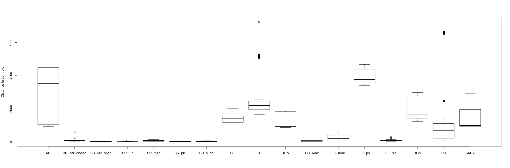

#Turnover vs nestedness 

| Region  | Jaccard  | Nestedness  | Turnover  |
|---|---|---|---|
|  All |   0.99673316 |   0.00724152 |  0.98949164 |   
|BR_car_open |0.4251581| 0.16879448| 0.2563636|
|  BR_jur |0.4305689| 0.24786999| 0.1826990|
|   DOM| 0.5482292| 0.25530446 |0.2929247|
| FG_sin |0.6765799 |0.31445050| 0.3621294|
| BR_car_closed |0.6921864 |0.43552522 | 0.2566612|
| SABA |0.7239656 |  0.19842857 | 0.5255370 |
| BR_s_do | 0.8049922 | 0.17451652 | 0.6304757|
|BR_pic | 0.8078839 | 0.32149132 | 0.4863926|
|FG_Kaw |0.8810121 |0.14435067| 0.7366614|
|BR_mac |0.8819087 |0.23501509 | 0.6468936 |
| CO |0.9555630 | 0.08625444 | 0.8693085| 
| HON |0.9572594 | 0.08436750 | 0.8728919 |
| AR |0.9607133 |0.13929247| 0.8214208|
|FG_nour| 0.9704462| 0.06353252| 0.9069137|
|FG_ps |0.9730999 |0.05209358 |0.9210063|
|PR |0.9741747 |0.04140182 |0.9327729|
|CR  | 0.9797605 |0.2112428| 0.7685177|

#BetaDisper by region

 